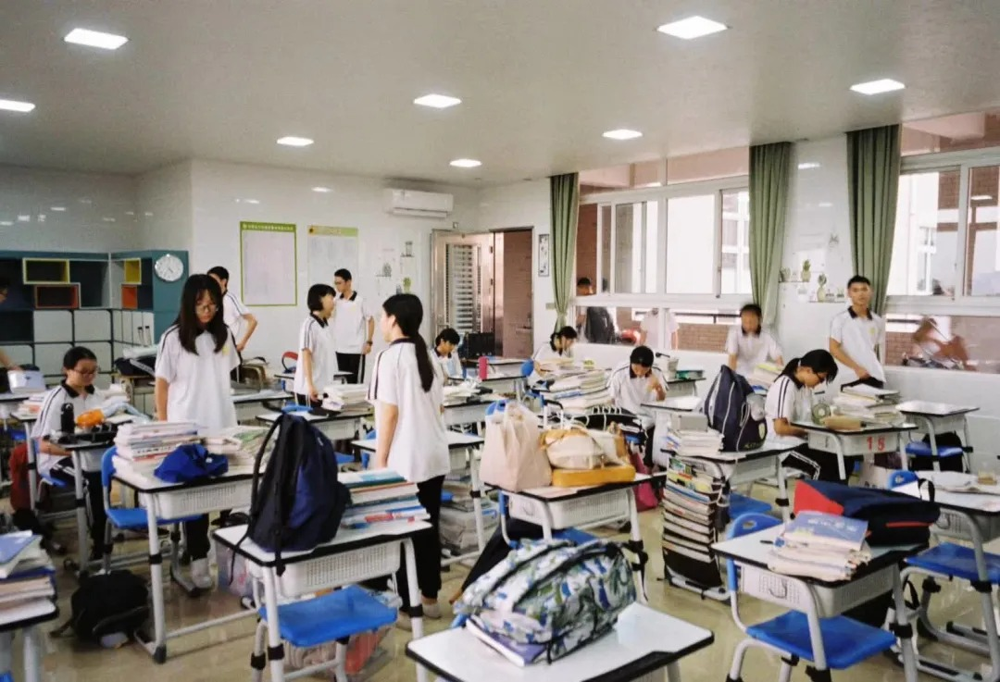

# 『愿世间美好与你们环环相扣』

[返回首页](../)

原创 Frater爱唱歌 星尘随想 2020-08-05

   

你总说毕业遥遥无期，转眼就各奔东西。——题记

当窗外的玉兰花开了又落，当合欢的清香弥漫在雨后的空气里，当我们来不及说再见就走上各自的人生轨迹......

时光搁浅了记忆，三年时光随风而至，时间的旅途一站接一站，我们终究来到了盛夏的尽头。青春时代的夏天总是美好的，粉红色的晚霞浸透着俏红的艳粉，傲着洒满漫无边际的银灰，淹没在余晖中的教学楼，像是要被时光凝固。橘子味的海风蔓延在跑道上，阳光落在方格裙角边，电扇轰鸣声荡出一整个盛夏的星语，打个西瓜味的饱嗝，篮球划出弧度，再下一场轰轰烈烈的三分雨。

这个夏天，将故事写成我们.......

不是每次相聚都充满欢笑，不是每次分离都眼含泪水。弹一曲青春恋曲，蓦首曾经无言的感伤，所有的不言而喻和纸短情长在此刻如同花雨般倾泻而出。夏日的帘幕悠悠地落下，毕业的脚步也悄然降临。我们将晦暗留给过往，将不舍盈满酒杯，用力地碰出属于我们的青春风采。

.jpg)

有人说，三年很长，1095天，26280个小时。也有人说，三年很短，不过毕业照三秒的时间。一场青春狂欢，一支夏日舞曲，写满了我们的匆匆岁月。那句来自胡夏的“好想再回到那些年的时光”终究无法跑过时光的滚轮，终究无法再回到那个最初的起点。

吹着冰激凌味的海风，我们有幸在那年盛夏遇见，我们如此不同，但青春却一样灿烂。你们青涩的脸庞带来的不仅仅是温柔与快乐，更传递着温暖与力量。三年的时光，我把你们写进我的青春年华。

 “我们把梦倒进夏天，让这个盛夏，比梦想更接近梦想”

.jpg)

阳光炽热，我们满怀不舍离开装满悲欢回忆的校园。蝉鸣喧嚣，我们与知心朋友挥手别离，各奔东西。玉兰浓郁，我们也与那个略显稚嫩的自己告别。

当我们在签名表上留下最后的字迹时，当我们在最后一天每节课后道那一声“老师辛苦了”时，当我们临走前久久凝望曾经陪伴自己的教师和同学时，所有的感伤都已成无言。

当你的同学拍了拍你的肩膀说“毕业快乐”时，当你带着满满当当的行李离开宿舍时，当你感慨一切都结束时，请记住，我们的青春永不褪色，我们的青春永不落幕。

.jpg)

正如不同的色彩能擦出缤纷绚烂的烟火，不同的我们也描绘着四班锦绣纷呈般的画卷。无论是爱拍照英语特别好的顺源，天天卖萌的兰优，口嗨爱抬杠的强哥，“四班骄傲”加冕的博哥，腹有四班情怀的中二哥，亦或是“表面平如止水，内心波涛汹涌”的子辕，独爱F4和画画的Jerry，遇到小姐姐会害羞的小雪，兼具腹肌和强迫症的老林，一天洗三次澡的biang狗，还是富到流油的“紫金焜少”，爱练篮球的狗茂......你们像一颗颗夜空中最亮的星，闪耀在我的回忆里，闪耀在我的青春里。

也许在许多年后，我依然会想起自己曾经扮演小兔子的英语配音大赛，会想起给zbw当“儿子”的语文话剧表演，会想起许下新年愿望的元旦晚会，会想起最最难忘的校运盛会......

也许在许多年后，你们依然记得那场万众瞩目渴望胜利的篮球赛，记得那场团结一心战胜八班的排球赛，记得那场崴伤博哥的羽毛球赛，记得那场高呼“文明观球”的女足大战......

         
三年真的很快。

.jpg)

青春本就是场马不停蹄的相遇和错过，来时五湖四海，走时天南地北。

 就好像周杰伦《最长的电影》里唱的那样：

我们的故事是很长的电影

 放映了三年我票都还留着

或许在不久的将来，你们会遇见更好的朋友，更好的班级，更好的自己。无论如何，希望我认识的你们，都可以实现自己的梦想，成为最好的自己。不论你的前程将奔赴哪个远方，请相信，一切都是最好的安排。前进的道路可能充满荆棘与鲜花，也许失败，也许成功。虽然生命中会有数不清的失去和选择，但是总有爱和梦想告诉你们，路在哪里。

记得有一句话说得特别好，我也想把它送给你们：“在我的电影里没有配角，因为在我心里，你们都是主角。”

图片

         

愿你们都能在自己的世界里闪闪发光。

祝：繁花似锦，韶华灿烂。

星尘

2020年8月5日迹

文字：林榕达

排版：林榕达

图片：王顺源

