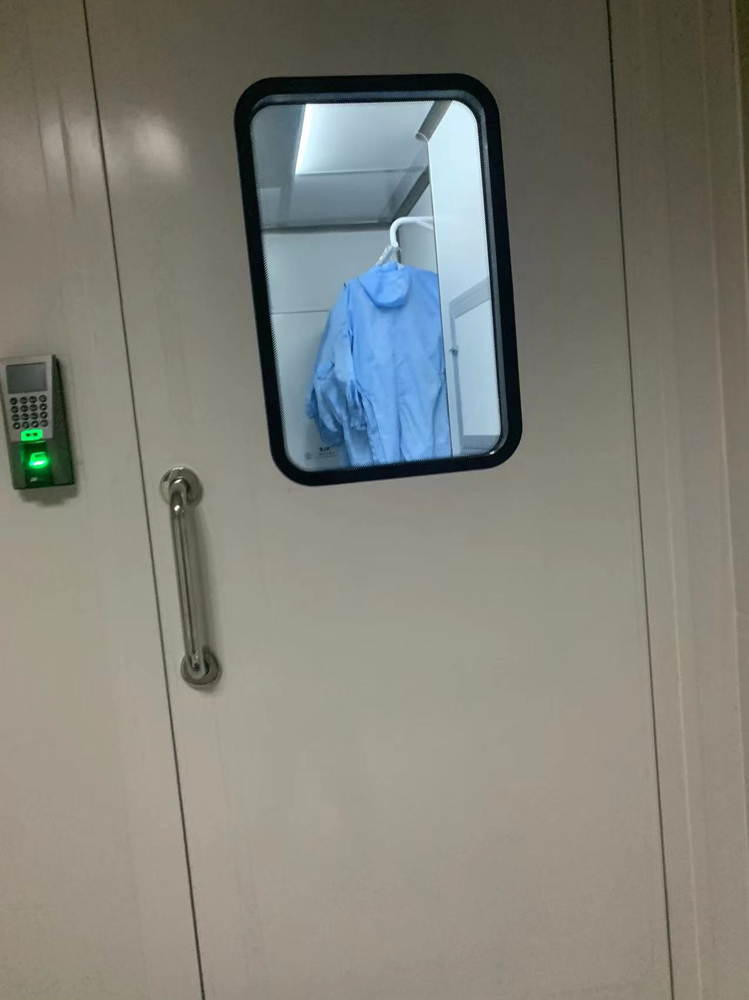
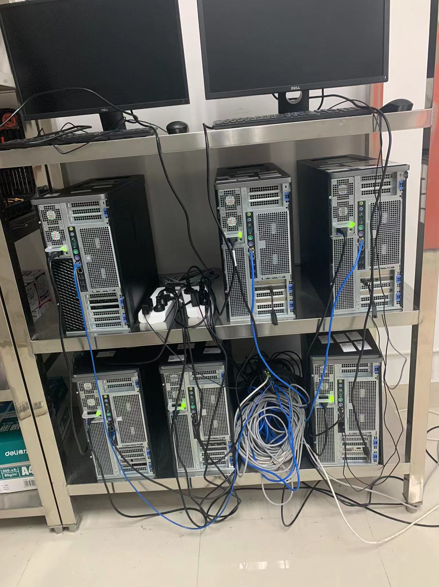
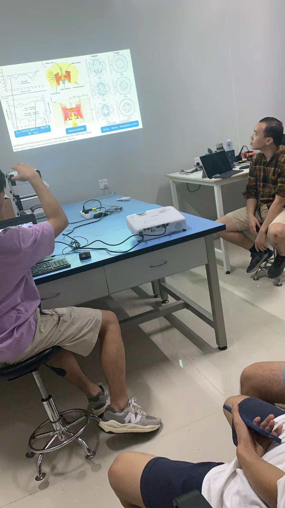

# 『近况杂谈』成败与欢悲

[返回首页](../)

2021年10月30日晚

已经好久没有写了，这可能也是我这段时间的缩影吧。

这段时间，我总是十分忙碌，在做必须做的时，也在做要求自己的事。这段时间有很多进步，也有很多遗憾。

可能是人的本性如此吧，在忙碌时总感觉自己虽然很忙却一事无成，但是跳出来看却发现自己有不少的成就。

我总感觉上天是眷顾，我的从开学得知有实验室招人，我便下定决心要进实验室提升自己，但是却遇到许多坎坷，要么是要求太高，我达不到到，要么是我去晚了，时运不佳，我只能报了一个感觉没有那么厉害的实验室，像是给自己找后路一样。老师很好，大早上给我打电话和我约见面时间，现在看来这个实验室可能是整个学校少有的“好”的实验室。

科研工作十分辛苦，像我一样刚入门的局外人，也能感受到。大二的学业压力本来就比较重，进了一个与自己学科方向完全不同的实验室，就相当于同时修两个学位，学两门不同的课。我用了很多时间去完成课内和实验室的任务，虽然说比较累，但是却能感觉到自己已经适应了不断努力的生活。每天花时间大量的时间去学那些让人讨厌的东西，确实让我感觉到自己在做正事。

这段时间我也是不断让自己更快乐，我觉得没有娱乐学习是难以忍受的，所以每次当有我想看的电影，我一定会拉入去，感觉累的时候，也会拉入去玩。安排完行程后，我都会像等放假一样期待那一天，可惜在学校中就不能像真正放长假一样无忧无虑地玩。

可能是由于最近的忙碌，我也很少去回味以前的生活。我感觉我和许多人像是不一样的人生，不一样的大学，不一样大学时光，他们有大量的时间去玩，我经常是把周末拆成一半来过。很多时候不是我不想去玩，是没有时间，有许多任务要完成。我只希望我的这些努力会有成果。

我以前从来没有一个人自己出去玩过，以前我总是疑惑为什么自己一个人出去孤孤单单有什么好玩的。现在才明白要的是安静，今天，我一个人出去看电影、一个人逛、一个人吃东西、一个人打车，感觉无比的安静。可能是见太多人了、可能是因为太多人给我压力和任务了。

今天不是什么大日子，随便写写。总之，希望以后我能找更多人，安排更多活动活得快快乐乐。希望我能做好实验室的任务、学好习、变得更强。
